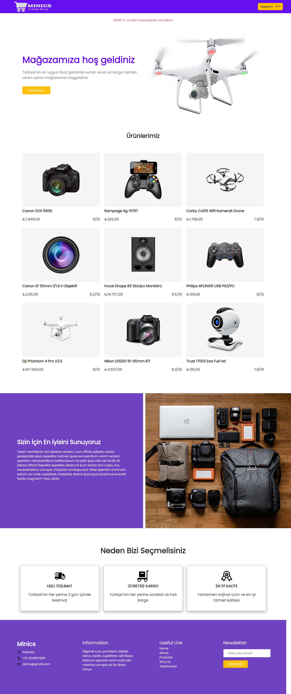
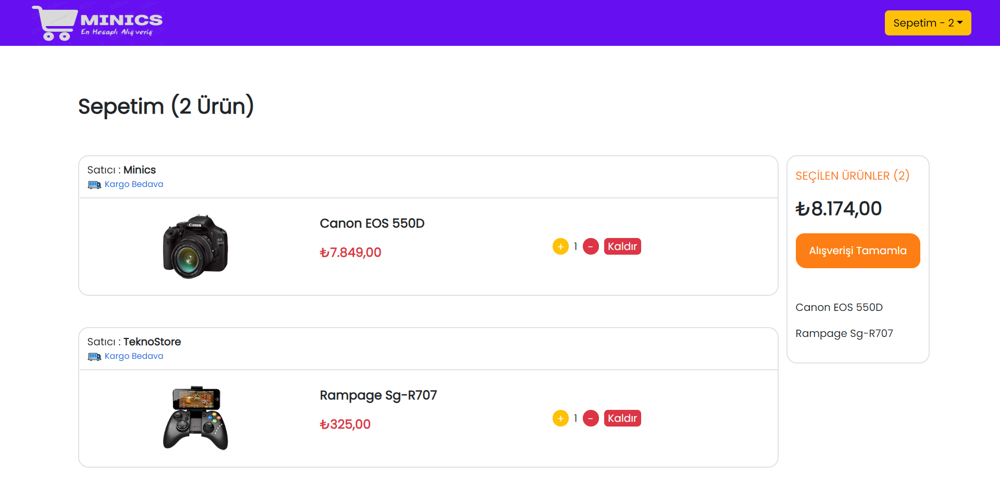
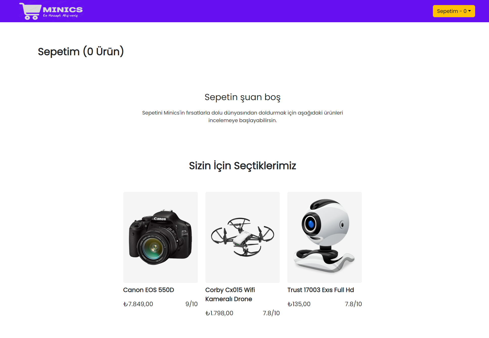

# About The Project

It is an e-commerce project prepared using ReactJS, Bootstrap, Css. Designed and crafted from a ready-made e-commerce website template.

## Images

### Home Page

### Basket Page

### Basket Page

## Start The Project

For installing 'npm' files in the project
### `npm install`

To get the project up and running
### `npm start`

## Languages and Libraries

<li>CSS
<li>Bootstrap
<li>Javascript
<li>ReactJS

## Contact

Oğuz Adıgüzel [Linkedin](https://www.linkedin.com/in/oğuz-adıgüzel-2672a8242). - oguz_adiguzel@outlook.com

Project Link : [https://github.com/oguz-adiguzel/minics-shop](https://github.com/oguz-adiguzel/minics-shop).

Vercel Link : [https://minics-shop.vercel.app](https://minics-shop.vercel.app)